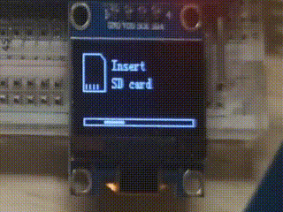

<a id="top"></a>

<p align="center">
  <strong>中文</strong> · <a href="README_EN.md">English</a>
</p>

<div align="center">

# SD Card OVID Player

**基于 STM32F103、Micro SD 和单色 OLED 的离线帧视频播放器**

<p>
  
  
  
  
</p>

<p>
  <a href="#quick-start"><strong>快速开始</strong></a> ·
  <a href="#hardware"><strong>硬件接线</strong></a> ·
  <a href="#create-ovid"><strong>制作 OVID</strong></a> ·
  <a href="#troubleshooting"><strong>常见问题</strong></a> ·
  <a href="CHANGELOG.md"><strong>更新记录</strong></a>
</p>

<p>
  <a href="https://github.com/akasa828/SD_Card_OVID_Player">GitHub 仓库</a> ·
  <a href="https://github.com/akasa828/SD_Card_OVID_Player/archive/refs/heads/main.zip">下载源码 ZIP</a> ·
  <a href="https://github.com/akasa828/SD_Card_OVID_Player/releases/latest">最新 Release</a>
</p>

</div>

> [!TIP]
> 可直接用于测试播放和错误处理的示例 `.BIN` 文件已打包，仅在 [GitHub Releases](https://github.com/akasa828/SD_Card_OVID_Player/releases/latest) 中提供下载。

> [!NOTE]
> 新的 [OVID Converter v1.3.0-beta.1](https://github.com/akasa828/SD_Card_OVID_Player/releases/tag/v1.3.0-beta.1) 可以直接把图片、图片目录、GIF 或常见视频转换为 OVID `.BIN`，无需再手动生成中间 `.c/.h` 文件。这是首次公开测试版。

SD Card OVID Player 是一个基于 STM32 HAL 的 STM32F103C8T6 离线帧视频播放器。视频文件存放在 Micro SD 卡中，由 FatFs 负责文件访问，固件完成文件浏览和校验后，再按照文件头中的帧率将画面输出到 SSD1306 或 SH1106 单色 OLED。播放过程只需要三个按键，不依赖电脑或网络。这里使用的 OVID 可以理解为 OLED Video，它是一种给单色屏准备的帧数据格式。

工程使用 CMake 构建，并提供面向 VS Code、STM32 官方扩展和 ST-Link 的配置；下载完整源码后，可以直接在 VS Code 中构建、刷写和调试。

这是一个个人学习和实验性质的嵌入式项目，目前仅在 STM32F103C8T6、SSD1306 OLED 和 SPI Micro SD 模块的组合上进行测试。

仓库现在按芯片平台分目录管理：`STM32F103/` 是当前可用的完整固件，`ESP32/` 暂时作为后续移植的空目录。

<a id="navigation"></a>

<p align="center"><strong>🧭 文档导航</strong></p>

<table align="center">
  <thead>
    <tr>
      <th>🚀 用户指南</th>
      <th>🧰 开发者参考</th>
    </tr>
  </thead>
  <tbody>
    <tr>
      <td><a href="#showcase">UI 展示</a> · <a href="#roadmap">未来计划</a></td>
      <td><a href="#features">主要特性</a> · <a href="#motivation">项目初衷</a></td>
    </tr>
    <tr>
      <td><a href="#quick-start">快速开始</a> · <a href="#hardware">硬件接线</a> · <a href="#flash">烧录固件</a></td>
      <td><a href="docs/OVID_FORMAT.md">OVID 格式</a> · <a href="docs/PORTING.md">屏幕适配</a></td>
    </tr>
    <tr>
      <td><a href="#sd-card">准备 SD 卡</a> · <a href="docs/OVID_TUTORIAL.md">制作 OVID</a></td>
      <td><a href="#developer-reference">项目结构</a> · <a href="#developer-reference">资源占用</a></td>
    </tr>
    <tr>
      <td><a href="#controls">按键与播放</a> · <a href="docs/TROUBLESHOOTING.md">常见问题</a></td>
      <td><a href="#contributing">参与开发</a> · <a href="#license">许可证</a></td>
    </tr>
  </tbody>
</table>


<a id="showcase"></a>

## 🖼️ UI 展示

<p align="center">
  <br>
  <sub>实机运行与 OLED 播放效果</sub>
</p>
<p align="center">
  <br>
  <sub>等待插卡与启动 UI</sub>
</p>

<a id="roadmap"></a>

## 🗺️ 未来计划

- [ ] 受限于 STM32F103C8T6 当前的 Flash 和 RAM 容量，计划将播放器移植到 ESP32，并在资源更充足的平台上继续扩展功能。
- [x] 将 SPI Micro SD + FatFs 文件系统驱动和 SSD1306/SH1106 OLED 驱动分别整理成可独立使用、方便移植的模块。
- [ ] **正在进行中：** 简化从图片、GIF 或视频素材生成 OVID `.BIN` 文件的转换流程。当前已提供 OVID Converter，预览、转换体验和 Windows 打包仍在继续完善。

<a id="features"></a>

## ✨ 特性

- **💾 完整的 SD 启动流程：** 等待插卡、挂载、计算卷容量、扫描视频文件，再依次显示存储、卡片和身份信息。文件优先从 `/function` 读取，没有匹配文件时回退到根目录读取。
- **🛡️ OVID v2 完整性校验：** 使用文件头 CRC16 和逐帧 CRC32。坏帧不会刷到 OLED，而是保留上一帧继续读取。
- **⏱️ 稳定播放时序：** 支持 1–120 FPS，并累计毫秒除法余数，长时间播放不会因整数截断逐渐变慢。
- **🖥️ 流畅的 OLED UI：** 使用双缓冲和 I2C DMA。128×64、1.4 MHz I2C 的正常环境下，动画按 16 ms 周期刷新。
- **📂 更易用的文件浏览器：** 支持长按加速、选中位置记忆、长文件名往返滚动，以及分辨率、帧率、帧数和格式版本轮播。
- **🔄 自动拔卡恢复：** 信息页和文件列表每 500 ms 探测一次卡状态；连续两次失败后卸载 FatFs 并返回等待插卡界面，播放读错误走同一套恢复流程。
- **💾 高效的 SD 卡驱动：** 依据 SD 卡规范实现 SPI 模式读写，并通过 `diskio` 接口接入 FatFs 文件系统。

> [!NOTE]
> 遇到 SD 超时或 I2C/DMA 故障恢复时，动画流畅度会暂时让位给可靠性。


### 🧩 可以单独参考的部分

如果你不需要完整播放器，也可以直接参考仓库中的这些模块：

| 内容 | 位置 |
|---|---|
| SSD1306/SH1106 OLED 绘图、双缓冲与 I2C DMA 驱动 | [独立驱动项目](https://github.com/akasa828/STM32-HAL-SSD1306-SH1106) · `STM32F103/Core/OLED/` |
| SPI Micro SD 驱动与 FatFs `diskio` 对接 | [独立驱动项目](https://github.com/akasa828/STM32-HAL-SPI-SD-FatFs) · `STM32F103/Core/Micro_SD/`、`STM32F103/Core/fatfs/` |
| 图片/GIF/视频直转、Img2Lcd 帧合并与 OVID 校验工具 | `tools/` |
| VS Code、CMake 与 ST-Link 构建调试配置 | `SD_Card_OVID_Player.code-workspace`、`STM32F103/.vscode/`、`STM32F103/CMakePresets.json` |

这些代码可以作为移植参考，但换用其他 STM32 型号或引脚时，仍需调整 HAL 外设句柄、GPIO 和时钟配置。

---

<a id="quick-start"></a>

## 🚀 快速开始

本项目在`Vscode`环境下开发，配合 [STM32CubeIDE for Visual Studio Code 扩展包](https://marketplace.visualstudio.com/items?itemName=stmicroelectronics.stm32-vscode-extension)完成。

1. **下载源码 ZIP。** 打开项目的 [GitHub 仓库](https://github.com/akasa828/SD_Card_OVID_Player)，点击 **Code → Download ZIP**，下载完整项目。
2. **解压项目。** 把 ZIP 完整解压到普通文件夹中，不要直接在压缩包预览界面里打开或编译。
3. **用 VS Code 打开工作区。** 在解压后的仓库根目录中打开 `SD_Card_OVID_Player.code-workspace`，左侧会同时显示 `STM32F103` 和 `ESP32`。如果只使用当前固件，也可以通过 **File → Open Folder**（文件 → 打开文件夹）直接打开包含 `CMakeLists.txt` 的 `STM32F103/` 目录。
4. **安装扩展。** 安装上述 [STM32 扩展包](https://marketplace.visualstudio.com/items?itemName=stmicroelectronics.stm32-vscode-extension)。首次打开时，接受项目发现、工具 bundle 下载和 CMake 配置提示，直到右下角不再提示下载 `Bundle` 包。
5. **选择构建类型。** 在 STM32/CMake 项目面板中选择 `Debug` 或 `Release`。调试建议选 Debug，正常烧录建议选 Release。
6. **连接并刷写。** 按[接线表](#wiring)连接 OLED、Micro SD、三个按键和 ST-Link，然后按 `F5`，选择 `STM32: Build, flash and debug with ST-Link`。扩展会自动构建并下载当前 preset 的 ELF；程序停在 `main` 时再按一次 `F5` 即可继续运行。
7. **准备 OVID 文件。** 把 SD 卡格式化为 FAT 或 FAT32，在根目录创建 `function` 文件夹。推荐下载 [OVID Converter v1.3.0-beta.1](https://github.com/akasa828/SD_Card_OVID_Player/releases/tag/v1.3.0-beta.1)，直接选择图片、图片目录、GIF 或视频并生成 `.BIN`；原有 Img2Lcd 流程仍可作为高级方式使用。
8. **插卡并播放。** 将 `DEMO.BIN` 放入 `/function`，插卡并复位。三张卡信息页结束后，用上下键选择文件，按确认键播放；播放中再次按确认键返回列表。

> [!NOTE]
> 首次配置需要联网下载项目声明的 STM32 工具 bundles。`v1.2.2` 仍是当前稳定固件，`v1.2.6` 是驱动模块化预发布版，`v1.3.0-beta.1` 是包含新转换器的当前 Latest Release；它仍带有 beta 标识，转换流程会继续完善。用于测试播放和错误处理的示例 `.BIN` 文件可在 Releases 中下载。

<a id="motivation"></a>

## 💡 项目初衷

这个项目最开始其实没想做得这么复杂。

起因只是看到很多人用 STM32 配合各种屏幕播放 Bad Apple，觉得挺有意思，于是就冒出了一个很简单的想法：我也想做一个。

不过既然要做，我又不太想把视频数据直接塞进 W25Q Flash 里。一方面容量有限，我转换出来的一个 `bad_apple.bin` 文件就已经接近 10 MB；另一方面，如果以后真的想把它继续做成一个“小播放器”，能够随时更换甚至存放多个文件，那么固定在 Flash 里的方式就不太合适了。

所以最后把目光放到了 SD 卡上：容量大、文件更换方便，而且比起“只能播放烧进去的那一个文件”，也更符合我对播放器的想象。

然后新的问题就来了：

STM32 怎么读取 SD 卡里的文件？

从这里开始，事情就逐渐变得不对劲了（笑）。

为了读取 SD 卡里的 `.bin` 文件，开始接触 SD 卡通信和 FatFs 文件系统；解决了文件从哪里来的问题以后，又要想办法把读取出来的数据送到 OLED 上显示。

偏偏当时自己的水平也不算高，从以前接触的一些代码转到 HAL 库对我来说就已经挺困难了。网上虽然能找到各种 OLED 驱动，但真正符合自己需求、基于 HAL 库、功能又比较完整的并不好找。有的只能显示文字，有的绘图功能比较少，有的移植过来以后还得继续修改。

而我又属于那种代码可以抄，但抄过来自己看不懂的话，后面基本就不会改了的人。

于是这个项目一度被我搁置了一个多月。

后来想了想，一直放着也不是办法。与其等自己“什么都会了”再回来做，不如先想办法让项目落地，遇到什么问题就解决什么问题。

于是又重新把它捡了起来。

最开始还是各种代码东拼西凑，只求 OLED 能亮、SD 卡能读、Bad Apple 能播出来；但随着对这些东西逐渐熟悉，项目也慢慢开始有了自己的结构和逻辑。

OLED 不再只是简单地显示几个字符，而是逐渐加入了画点、画线、绘制图形、显示图片和文字等功能；原本到处找现成代码的 OLED 部分，也逐渐整理成了自己真正能够理解和修改的 HAL 库驱动。

在 Bad Apple 真正能够播放以后，我又开始觉得：

既然 SD 卡里可以放文件，那为什么只能播放一个写死的文件？

于是又继续往里面加入文件读取、文件选择和 UI，让它从最开始一个“想在 STM32 上播放 Bad Apple”的小实验，一步步变成了现在这个能够读取 SD 卡文件、控制 OLED 显示，并且拥有自己 UI 和操作逻辑的小项目。

所以回头来看，这个项目真正解决的其实不只是“怎么在 STM32 上播放 Bad Apple”。

一方面，我希望整理出一套基于 HAL 库、功能尽可能完整，而且真正方便拿来使用的 OLED 驱动，让以后有类似需求的人不用再到处找零散代码。

另一方面，对我自己来说，它也算是一次很完整的学习过程：

从找代码、拼代码，到尝试看懂代码，再到自己修改代码、设计功能，最后让一个原本停留在想法里的东西真正跑起来。

至于最开始那个“在 STM32 上播放 Bad Apple”的想法……

大概只是没想到，最后为了播它，要折腾这么多东西（笑）。

<a id="hardware"></a>

## 🔌 硬件与接线

当前工程使用以下硬件及材料：

- 面包板
- 跳线
- 公对公 x3
- 母对母 x10
- STM32F103C8T6 最小系统板；链接脚本按 64 KiB Flash、20 KiB RAM 配置
- SSD1306 或 SH1106 I2C 单色 OLED
- SPI 接口的 Micro SD 卡模块，使用 3.3 V 逻辑电平
- 三个按键
- 可选的 3.3 V USB-TTL 模块，用来看串口诊断

<a id="wiring"></a>

### 📌 接线表

| 功能 | STM32 引脚 | 外设端 | 说明 |
|:---:|:---:|:---:|:---:|
| SPI1 SCK | PA5 | SD SCK/CLK | SPI mode 0 |
| SPI1 MISO | PA6 | SD MISO/DO | SD → MCU |
| SPI1 MOSI | PA7 | SD MOSI/DI | MCU → SD |
| SD CS | PB0 | SD CS | 低电平选中 |
| I2C1 SCL | PB6 | OLED SCL | 开漏，需要上拉 |
| I2C1 SDA | PB7 | OLED SDA | 开漏，需要上拉 |
| 上键 | PB1 | 按键另一端接 GND | 内部上拉，下降沿 EXTI |
| 下键 | PB10 | 按键另一端接 GND | 内部上拉，下降沿 EXTI |
| 确认键 | PB11 | 按键另一端接 GND | 内部上拉，下降沿 EXTI |
| USART1 TX | PA9 | USB-TTL RX | 可选，115200 8N1，仅发送 |
| 共地 | GND | SD/OLED/按键/串口 GND | 必须共地 |
| 供电 | 3.3 V | SD/OLED VCC | 先确认模块电压要求 |


<a id="flash"></a>

## ⚡ 烧录到 STM32

### 1. 连接 ST-Link

烧录使用 STM32F103 的 SWD 接口：

| ST-Link | STM32F103C8T6 | 说明 |
|---|---|---|
| SWDIO | PA13 | SWD 数据 |
| SWCLK | PA14 | SWD 时钟 |
| GND | GND | 必须共地 |
| NRST | NRST | 可选，但连接后更容易处理无法连接的情况 |
| VTref/3.3 V | 3.3 V | 作为目标电压参考；是否能给目标板供电取决于探针型号 |

| ST-Link | SD卡读卡器 | 说明 |
|---|---|---|
| 5V | 5V | 通电 |
| GND | GND | 必须共地 |

> [!WARNING]
> 目标板可以单独使用稳定的 3.3 V 电源。不要在不了解 ST-Link 供电方式时，让外部电源和 ST-Link 同时向同一条 3.3 V 电源轨供电。正常从 Flash 启动时，板上的 `BOOT0` 应保持低电平。

### 2. 在 VS Code 中按 F5

连接 ST-Link 后，在左侧 **Run and Debug** 中选择 `STM32: Build, flash and debug with ST-Link`，再按 `F5`。`STM32F103/.vscode/launch.json` 会调用官方扩展完成以下工作：

```text
构建当前 CMake preset → 取得对应 ELF → 通过 ST-Link 下载 → 停在 main
```

第一次停在 `main` 后，再按一次 `F5` 就会继续运行。这里没有写死 `build/Debug`、盘符或用户名；选择 Release preset 时，扩展会使用 Release 对应的 ELF。

<details>
<summary><strong>备用：使用 STM32CubeProgrammer 手动烧录</strong></summary>

扩展不可用时，也可以使用 STM32CubeProgrammer 的图形界面：

1. 接好 ST-Link 和目标板，再打开 STM32CubeProgrammer。
2. 在右侧连接方式中选择 `ST-LINK`，接口选择 `SWD`，点击 **Connect**。
3. 点击 **Open file**，选择：

   ```text
   STM32F103/build/Release/SD_Card_OVID_Player.elf
   ```

4. 点击 **Download**。下载完成并通过校验后，点击复位按钮，或者给目标板重新上电。

实际使用建议烧录 Release。Debug 同样可以运行，但会占用更多 Flash，主要用于断点调试和故障排查。

如果更习惯命令行，可以把 STM32CubeProgrammer 的 `bin` 目录加入 `PATH`，再进入 `STM32F103/` 目录执行：

```powershell
STM32_Programmer_CLI.exe -c port=SWD `
  -w "build/Release/SD_Card_OVID_Player.elf" -v -rst
```

同一条命令写成单行是：

```powershell
STM32_Programmer_CLI.exe -c port=SWD -w "build/Release/SD_Card_OVID_Player.elf" -v -rst
```

其中 `-w` 写入固件，`-v` 回读校验，`-rst` 在完成后复位目标板。这里烧录的是 ELF，所以不附加写入地址。如果以后自行导出裸 `.bin`，才需要把 `0x08000000` 作为写入地址传给烧录工具。

</details>


<a id="sd-card"></a>

## 💾 准备 SD 卡

固件支持 FAT12、FAT16 和 FAT32，不支持 exFAT 或 NTFS。FatFs 已开启最长 63 字符的长文件名，不过 OLED 字库只包含 ASCII 字符，文件名最好仍使用 ASCII 或英文字符

推荐的目录结构如下：

```text
SD 卡根目录/
├── function/          # 这里有 .BIN 时优先使用
│   ├── DEMO01.BIN
│   └── DEMO02.BIN
└── ROOTVID.BIN        # /function 没有 .BIN 时才会扫描到
```

固件不会自动创建 `/function`。首次插卡时，`f_getfree()` 会实际扫描 FAT 来计算剩余空间，不相信可能已经过期的 FAT32 FSInfo，所以大容量或碎片较多的卡可能需要等几秒。进度条用千分比定点值平滑追赶真实扫描进度，活动点仍会持续移动，不会只按整数百分比一格一格跳。

> [!TIP]
> 如果不想等待，可以在扫描页按确认键跳过。播放器会显示 `Free: N/A`，但仍然继续扫描文件并进入列表；`100%` 只会在 `f_getfree()` 真正返回后出现。

<a id="create-ovid"></a>

## 🎬 OVID 制作教程

推荐流程已经缩短为：

```text
下载 OVID Converter
→ 安装或解压
→ 选择图片、图片目录、GIF 或视频
→ 预览并设置尺寸/FPS
→ 生成 OVID .BIN
```

- [下载安装版](https://github.com/akasa828/SD_Card_OVID_Player/releases/download/v1.3.0-beta.1/OVID_Converter_Windows_x64_Setup_v1.3.0-beta.1.exe)
- [下载 Windows x64 便携版](https://github.com/akasa828/SD_Card_OVID_Player/releases/download/v1.3.0-beta.1/OVID_Converter_Windows_x64_Portable_v1.3.0-beta.1.zip)

便携版解压即可运行，安装版提供中英文安装界面、开始菜单和可选桌面快捷方式；两者都已经包含运行时、Pillow 和 FFmpeg，不要求用户预先安装 Python。

当前 `v1.3.0-beta.2` 开发版默认使用固定阈值 `128`，也可以在转换参数中切换为 Floyd–Steinberg 抖动；上方 `beta.1` 下载包仍沿用此前的默认设置。

> [!WARNING]
> 当前 Windows 程序没有代码签名证书，SmartScreen 可能显示“未知发布者”。请只从本仓库 Release 下载，并用同一页面中的 `SHA256SUMS.txt` 校验文件。

原有的图片准备、IrfanView、Img2Lcd 取模、帧合并和 `h2bin.py` 流程仍完整保留，适合需要检查或手动控制每一步数据的人：[查看可选的高级制作教程](docs/OVID_TUTORIAL.md)。

<a id="controls"></a>

## 🎮 按键与播放流程

| 按键 | 文件列表 | 播放中 |
|---|---|---|
| PB1 上 | 上一个文件；长按连续滚动并加速 | 无操作 |
| PB10 下 | 下一个文件；长按连续滚动并加速 | 无操作 |
| PB11 确认 | 播放选中的文件 | 停止播放并返回列表 |

按键使用下降沿中断和大约 150 ms 的软件去抖。启动后的完整流程是：

```text
等待插卡 → 初始化 SD → 挂载 FatFs → 计算剩余空间
         → 扫描文件 → 三张卡信息页 → 文件列表 → 播放
```

三张信息页分别显示文件系统与卷容量、SD 卡类型与物理容量、CID 身份信息。每页停留 3000 ms；前 300 ms 中，白色区域从屏幕左侧横向扩张，扫过的文字和图形变成白底黑色，反显区域会保留到这一页结束。这里不是一条滑过后消失的窄光带，也没有旧版的整页滑入、滑出。

普通状态提示使用同样的横向反显语言；`Loading / 文件名` 和 `Library / Playback stopped` 保留中心小矩形展开、收起的动画。小方框弹窗停留 1200 ms，按确认键可以提前关闭。

文件列表中，选中的长文件名静止约 700 ms 后开始往返滚动。底部信息每 1500 ms 在“分辨率/FPS”和“帧数/OVID 版本”之间切换；同一窗口内的选择框使用缓动，跨页时则直接对齐，避免选择框穿过无关条目。

<a id="troubleshooting"></a>

## 🩺 诊断与常见问题

串口诊断、开机诊断模式、看门狗、HardFault 记录和常见问题已整理到独立文档：[查看诊断与常见问题](docs/TROUBLESHOOTING.md)。

<a id="developer-reference"></a>

## 🧰 开发者参考

下面这些内容主要面向格式分析、屏幕移植和二次开发。

| 文档 | 内容 |
|---|---|
| [📦 OVID 文件格式](docs/OVID_FORMAT.md) | 16 字节文件头、页主序与 CRC |
| [🖥️ 屏幕适配与 I2C](docs/PORTING.md) | 尺寸宏、控制器与 1.4 MHz 说明 |

<details>
<summary><strong>🗂️ 项目结构</strong> — 固件、驱动、工具与配置目录</summary>

```text
.
├── STM32F103/               # 当前可用的 STM32F103 固件工程
│   ├── .settings/           # STM32 扩展的工具 bundle 清单
│   ├── .vscode/             # 扩展推荐、clangd 和 ST-Link 配置
│   ├── CMakeLists.txt / CMakePresets.json
│   ├── SD_Card_OVID_Player.ioc
│   ├── Core/                # 主程序、SD、FatFs、OLED、UI 与播放器
│   ├── Drivers/             # STM32 HAL 与 CMSIS
│   └── cmake/               # CubeMX CMake 和 Arm GCC 工具链
├── ESP32/                    # 后续 ESP32 移植的空目录
├── docs/images/             # 预留的实机图片与 UI 动图位置
├── tools/
│   ├── ovid_converter_gui.py # Material 3 桌面转换器
│   ├── media2ovid.py        # 图片/GIF/视频直转核心与命令行
│   ├── h2bin.py             # 取模头文件打包与 OVID 校验
│   └── merge_img2lcd.py     # 合并 Img2Lcd 单帧 C 数组
└── SD_Card_OVID_Player.code-workspace
```

`STM32F103/Core/隐藏关卡/` 是仓库中的真实历史目录，工具示例也引用了它，所以这里没有只在文档里把它改成英文。若以后重命名，需要一起更新脚本注释、命令示例和相关路径。

</details>

<details>
<summary><strong>📊 构建占用与验证</strong> — Flash、RAM 与编译矩阵</summary>

下面的数据来自 Arm GNU Toolchain 14.3.1、默认 128×64 和双缓冲配置：

| 构建 | Flash | RAM |
|---|---:|---:|
| Debug (`-Os -g3`) | 55,812 B / 64 KiB（85.16%） | 10,040 B / 20 KiB（49.02%） |
| Release (`-Os -g0`) | 55,800 B / 64 KiB（85.14%） | 10,040 B / 20 KiB（49.02%） |

> [!NOTE]
> Debug 仍保留完整诊断路径和 `-g3` 调试符号，但为兼容不同版本 GNU Arm 工具链的代码尺寸，也使用 `-Os`。单步调试时个别变量可能被优化；平时运行仍建议使用 Release。85% 左右的 Flash 占用并不算非常宽裕，继续增加字库或大段 UI 文案前仍然要看一次 `arm-none-eabi-size`。

当前已经重新完成 128×32、128×64、128×128 和 96×64 的编译验证，也覆盖了 SSD1306、SH1106 两条控制器分支。128×128 Debug 最大矩阵配置占用 12,088 B RAM（59.02%）。转换工具检查覆盖 Python 语法和 OVID 测试文件重新生成流程。

30 分钟连续播放、真实热拔插，以及不同 OLED 模块在 1.4 MHz 下的信号完整性仍然属于目标板测试，主机编译不能替代这些结果。

</details>

<p align="right"><a href="#top">⬆️ 返回顶部</a></p>

<a id="contributing"></a>

## 🤝 参与开发与反馈

欢迎针对屏幕适配、SD 兼容性、OVID 工具和 UI 行为提交 [Issue](https://github.com/akasa828/SD_Card_OVID_Player/issues) 或 Pull Request。

提交前请先阅读[贡献指南](CONTRIBUTING.md)；涉及不应公开的安全细节时，请按照[安全策略](SECURITY.md)进行报告。

<a id="latest-update"></a>

## 📝 最近一次更新

当前开发版本为 **v1.3.0-beta.2**，尚未发布；[**v1.3.0-beta.1**](https://github.com/akasa828/SD_Card_OVID_Player/releases/tag/v1.3.0-beta.1) 仍是包含 Material 3 桌面转换器的当前 Latest Release。**v1.2.2** 是稳定固件，**v1.2.6** 是驱动模块化预发布版。

完整的版本记录放在 [CHANGELOG.md](CHANGELOG.md)

<a id="license"></a>

## 📄 许可证

项目自有代码使用 [MIT License](LICENSE)，版权人为 `riochihao`。

仓库中包含的第三方代码仍遵循各自许可证，主要包括：

- [STM32F1 HAL Driver](STM32F103/Drivers/STM32F1xx_HAL_Driver/LICENSE.txt)
- [CMSIS](STM32F103/Drivers/CMSIS/LICENSE.txt)
- [STM32F1 CMSIS Device](STM32F103/Drivers/CMSIS/Device/ST/STM32F1xx/LICENSE.txt)
- FatFs：许可证说明位于 `STM32F103/Core/fatfs/ff.c`、`ff.h` 和相关源文件头部
